# This repository contains the [Full Stack Open course](https://fullstackopen.com/) part5 exercises

**All exercises are saved in a separate commit.**

## Exercises 5.1.-5.4

We will now create a frontend for the blog list backend we created in the last part. You can use [this application](https://github.com/fullstack-hy2020/bloglist-frontend) from GitHub as the base of your solution. You need to connect your backend with a proxy as shown in [part 3](https://fullstackopen.com/en/part3/deploying_app_to_internet#proxy).

It is enough to submit your finished solution. You can commit after each exercise, but that is not necessary.

The first few exercises revise everything we have learned about React so far. They can be challenging, especially if your backend is incomplete. It might be best to use the backend that we marked as the answer for part 4.

While doing the exercises, remember all of the debugging methods we have talked about, especially keeping an eye on the console.

**Warning:** If you notice you are mixing in the `async/await` and `then` commands, it's 99.9% certain you are doing something wrong. Use either or, never both.

### 5.1: Blog List Frontend, step 1

Clone the application from [GitHub](https://github.com/fullstack-hy2020/bloglist-frontend) with the command:

```bash
git clone https://github.com/fullstack-hy2020/bloglist-frontend.git
```

Remove the _git configuration_ of the cloned application

```bash
cd bloglist-frontend   // go to cloned repository
rm -rf .git
```

The application is started the usual way, but you have to install its dependencies first:

```bash
npm install
npm run dev
```

Implement login functionality to the frontend. The token returned with a successful login is saved to the application's state user.

If a user is not logged in, _only_ the login form is visible.

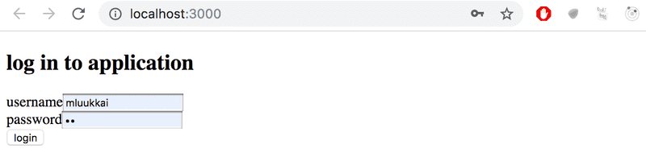

If the user is logged-in, the name of the user and a list of blogs is shown.

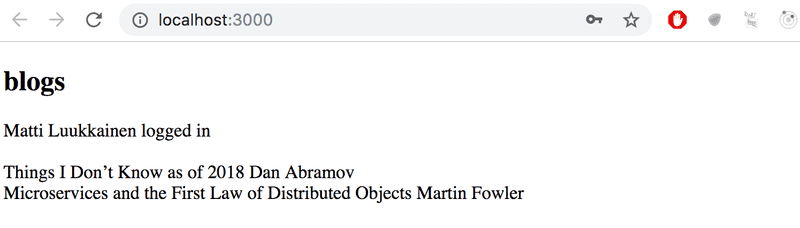

User details of the logged-in user do not have to be saved to the local storage yet.

**NB** You can implement the conditional rendering of the login form like this for example:

```jsx
  if (user === null) {
    return (
      <div>
        <h2>Log in to application</h2>
        <form>
          //...
        </form>
      </div>
    )
  }

  return (
    <div>
      <h2>blogs</h2>
      {blogs.map(blog =>
        <Blog key={blog.id} blog={blog} />
      )}
    </div>
  )
}
```

### 5.2: Blog List Frontend, step 2

Make the login 'permanent' by using the local storage. Also, implement a way to log out.

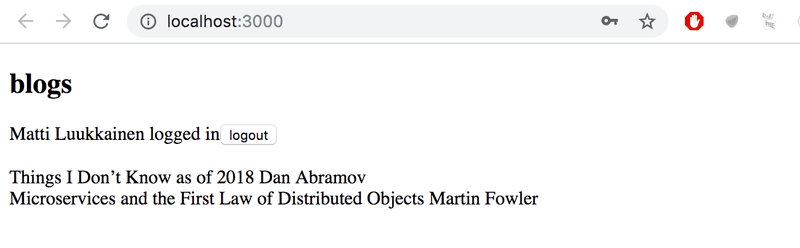

Ensure the browser does not remember the details of the user after logging out.

### 5.3: Blog List Frontend, step 3

Expand your application to allow a logged-in user to add new blogs:

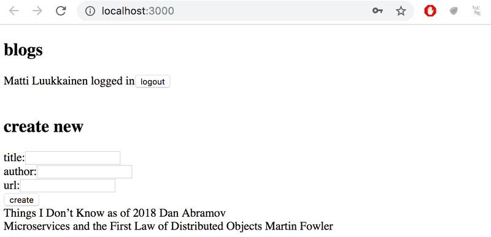

### 5.4: Blog List Frontend, step 4

Implement notifications that inform the user about successful and unsuccessful operations at the top of the page. For example, when a new blog is added, the following notification can be shown:

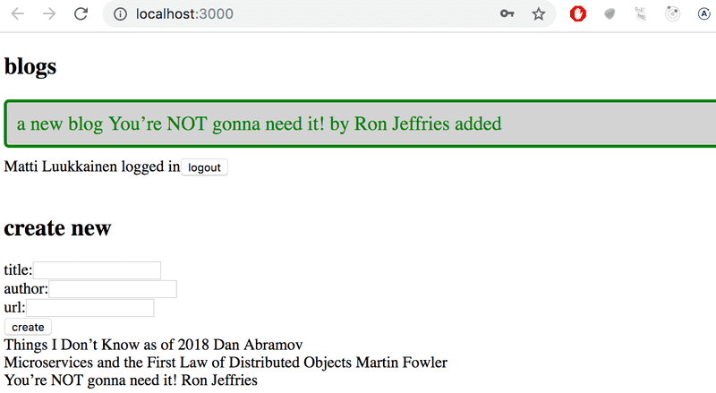

Failed login can show the following notification:

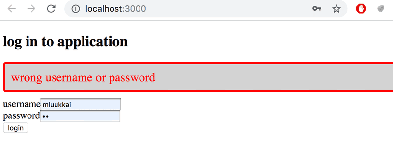

The notifications must be visible for a few seconds. It is not compulsory to add colors.

## Exercises 5.5.-5.11

### 5.5 Blog List Frontend, step 5

Change the form for creating blog posts so that it is only displayed when appropriate. Use functionality similar to what was shown [earlier in this part of the course material](https://fullstackopen.com/en/part5/props_children_and_proptypes#displaying-the-login-form-only-when-appropriate). If you wish to do so, you can use the _Togglable_ component defined in part 5.

By default the form is not visible

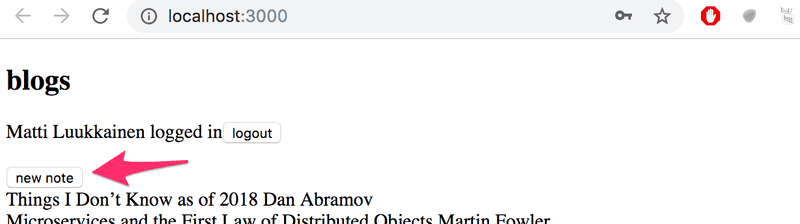

It expands when button _create new blog_ is clicked

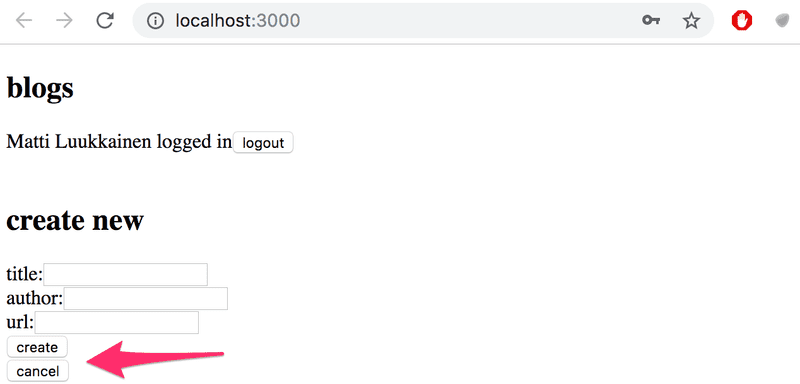

The form hides again after a new blog is created.

### 5.6 Blog List Frontend, step 6

Separate the form for creating a new blog into its own component (if you have not already done so), and move all the states required for creating a new blog to this component.

The component must work like the _NoteForm_ component from the [material](https://fullstackopen.com/en/part5/props_children_and_proptypes#state-of-the-forms) of this part.

### 5.7 Blog List Frontend, step 7

Let's add a button to each blog, which controls whether all of the details about the blog are shown or not.

Full details of the blog open when the button is clicked.

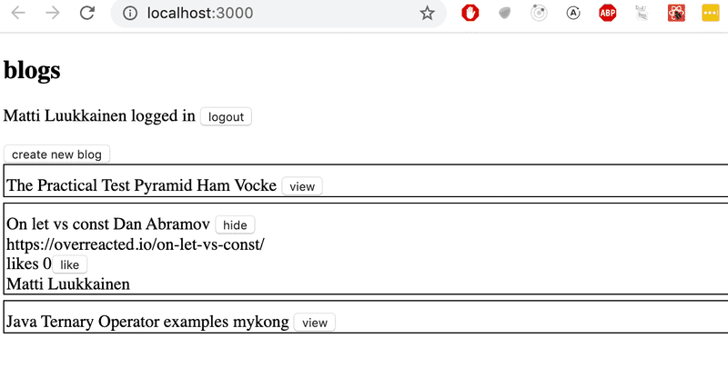

And the details are hidden when the button is clicked again.

At this point, the _like_ button does not need to do anything.

The application shown in the picture has a bit of additional CSS to improve its appearance.

It is easy to add styles to the application as shown in part 2 using [inline](https://fullstackopen.com/en/part2/adding_styles_to_react_app#inline-styles) styles:

```jsx
const Blog = ({ blog }) => {
  const blogStyle = {
    paddingTop: 10,
    paddingLeft: 2,
    border: 'solid',
    borderWidth: 1,
    marginBottom: 5,
  };

  return (
    <div style={blogStyle}>
      <div>
        {blog.title} {blog.author}
      </div>
      // ...
    </div>
  );
};
```

**NB:** Even though the functionality implemented in this part is almost identical to the functionality provided by the _Togglable_ component, it can't be used directly to achieve the desired behavior. The easiest solution would be to add a state to the blog component that controls if the details are being displayed or not.

### 5.8: Blog List Frontend, step 8

Implement the functionality for the like button. Likes are increased by making an HTTP PUT request to the unique address of the blog post in the backend.

Since the backend operation replaces the entire blog post, you will have to send all of its fields in the request body. If you wanted to add a like to the following blog post:

```jsx
{
  _id: "5a43fde2cbd20b12a2c34e91",
  user: {
    _id: "5a43e6b6c37f3d065eaaa581",
    username: "mluukkai",
    name: "Matti Luukkainen"
  },
  likes: 0,
  author: "Joel Spolsky",
  title: "The Joel Test: 12 Steps to Better Code",
  url: "https://www.joelonsoftware.com/2000/08/09/the-joel-test-12-steps-to-better-code/"
},
```

You would have to make an HTTP PUT request to the address _/api/blogs/5a43fde2cbd20b12a2c34e91_ with the following request data:

```json
{
  "user": "5a43e6b6c37f3d065eaaa581",
  "likes": 1,
  "author": "Joel Spolsky",
  "title": "The Joel Test: 12 Steps to Better Code",
  "url": "https://www.joelonsoftware.com/2000/08/09/the-joel-test-12-steps-to-better-code/"
}
```

The backend has to be updated too to handle the user reference.

### 5.9: Blog List Frontend, step 9

We notice that something is wrong. When a blog is liked in the app, the name of the user that added the blog is not shown in its details:

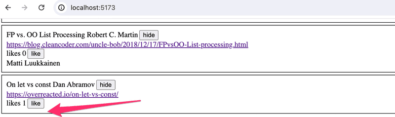

When the browser is reloaded, the information of the person is displayed. This is not acceptable, find out where the problem is and make the necessary correction.

Of course, it is possible that you have already done everything correctly and the problem does not occur in your code. In that case, you can move on.

### 5.10: Blog List Frontend, step 10

Modify the application to sort the blog posts by the number of likes. The Sorting can be done with the array [sort](https://developer.mozilla.org/en-US/docs/Web/JavaScript/Reference/Global_Objects/Array/sort) method.

### 5.11: Blog List Frontend, step 11

Add a new button for deleting blog posts. Also, implement the logic for deleting blog posts in the frontend.

Your application could look something like this:

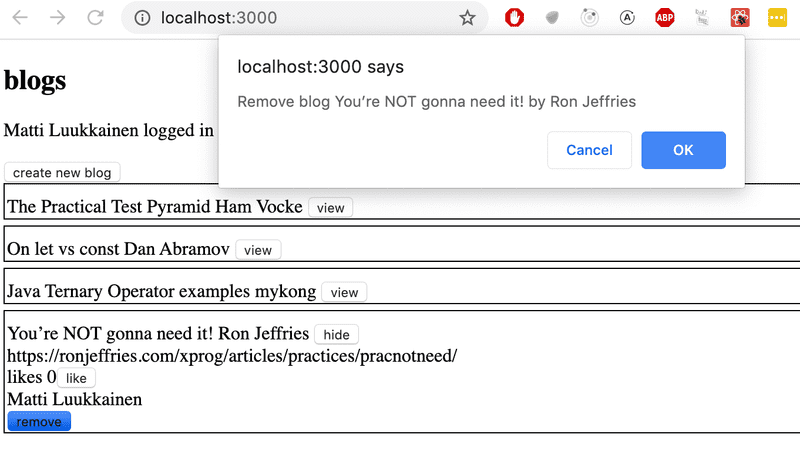

The confirmation dialog for deleting a blog post is easy to implement with the [window.confirm](https://developer.mozilla.org/en-US/docs/Web/API/Window/confirm) function.

Show the button for deleting a blog post only if the blog post was added by the user.

## Exercise 5.12

### 5.12: Blog List Frontend, step 12

Define PropTypes for one of the components of your application, and add ESlint to the project. Define the configuration according to your liking. Fix all of the linter errors.

Vite has installed ESlint to the project by default, so all that's left for you to do is define your desired configuration in the _.eslintrc.cjs_ file.
